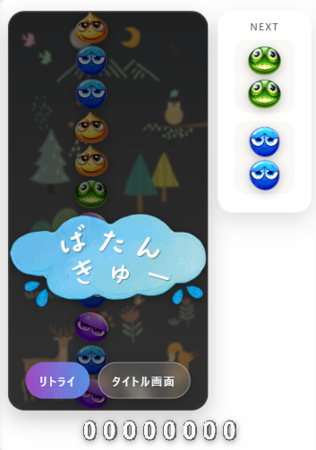

# 🧩 Lumapuyo – JavaScript Puzzle Game

> Not just a game — but an experience designed to evoke emotion.

A browser-based falling block puzzle game built with Vanilla JavaScript.
Designed with a focus on game feel, emotional feedback, and user experience.

Lumapuyo – JavaScriptパズルゲーム
感情とゲーム体験を設計した、ブラウザ型パズルゲーム

---

## 🎮 Overview

Lumapuyo is a browser-based puzzle game inspired by classic falling block games like Puyo Puyo.

This project focuses not only on gameplay mechanics but also on:

- Smooth animations
- Responsive controls
- Emotional feedback through visual effects

👉 Designed as a game development portfolio project demonstrating both
technical implementation and experience design.

## 🎮 概要

Lumapuyoは、JavaScriptで開発したブラウザ向けの落ちものパズルゲームです。

単なるゲーム実装ではなく、

- 操作の気持ちよさ
- 連鎖の爽快感
- 視覚的フィードバック

を重視し、「プレイヤーの感情を設計する」ことをテーマに開発しました。

👉 技術と体験設計の両面を表現したポートフォリオ作品です。

---

## 🎯 Purpose

To create a game that delivers the satisfying feeling of chain reactions
and demonstrates how emotion can be designed through interaction.

## 🎯 制作目的

連鎖による「気持ちよさ」を体験として提供し、
インタラクションによって感情をデザインできることを示すために制作しました。

---

## ✨ Demo

[](docs/lumapuyo.mp4)

🎥 Click to watch gameplay video

## ✨ デモ

[](docs/lumapuyo.mp4)

🎥 クリックで動画を再生できます

---

## 🧠 Concept – Designing Emotion

This project is built around the idea of:

> "Designing player emotion through game mechanics and feedback."

---

### 🎆 Emotional Flow Design

- Focus → Success → Satisfaction → Reward  
- Chain reactions create excitement  
- "All Clear" bonus enhances peak experience  

---

### 🎮 Game Feel & UX

- Smooth animation using `requestAnimationFrame`  
- Immediate input response  
- Mobile-friendly controls (swipe & tap)  

---

## 🧠 設計思想

### ■ 感情を設計する

本作品では、プレイヤーの感情の流れを意識しています。

👉 集中 → 成功 → 爽快感 → 余韻

- 連鎖時のスコア演出  
- 全消し時の特別演出  
- ゲームオーバー時の演出 

---

### ■ 操作ストレスの軽減

- requestAnimationFrameによる滑らかな描画  
- 即時反応する入力処理  
- モバイル操作（スワイプ・タップ対応）  

---

## 🏗️ Architecture Design

- Separation of logic and rendering  
- Board state managed independently from DOM  

```js
Stage.puyoBoard[y][x] = {
  puyoColor,
  element
};

## 🏗️ 保守性を意識した設計

- ロジックとDOMの分離
- 状態管理と描画の責務分離

---

## 🧪 Technical Highlights

🔗 Chain Detection Algorithm

Connected puyos are detected using a flood fill algorithm (DFS/BFS).

- Efficient group detection of same-colored puyos
- Prevents duplicate checks using visited flags
- Triggers chain reactions recursively

👉 Designed to balance performance and readability

---

## 🎮 Game Loop & Rendering

The game uses requestAnimationFrame for smooth updates.

- Frame-based game loop
- Time delta (dt) for consistent speed
- Synchronization between logic and rendering

👉 Ensures smooth and responsive gameplay

---

## 🧠 State Management

Game state is managed separately from DOM rendering.

Stage.puyoBoard[y][x] = {
  puyoColor,
  element
};

- Logical board state (2D array)
- DOM elements mapped to state
- Clear separation of concerns

👉 Improves maintainability and scalability

---

## ⚡ Input Handling Optimization

- Keyboard input with event listeners
- Mobile gestures (swipe / tap)
- Prevents input lag and unintended behavior

👉 Designed for cross-device usability

---

## 🎨 Visual Feedback System

- Score pop animations
- Chain reaction effects
- Game over transition effects

👉 Enhances player engagement and satisfaction

---

## 🚫 No Framework Policy

This project intentionally avoids frameworks.

- Pure Vanilla JavaScript
- Direct DOM manipulation
- Focus on core fundamentals

👉 Demonstrates strong understanding of JavaScript basics

---

## ⚙️ Tech Stack

- HTML / CSS
- Vanilla JavaScript
- requestAnimationFrame
- DOM manipulation
- Event handling

## ⚙️ 使用技術

- HTML / CSS
- JavaScript（Vanilla）
- requestAnimationFrame
- DOM操作
- イベント制御

---

## 🧩 Features

- Falling block mechanics
- Rotation & movement system
- Chain detection algorithm
- Score system with combo bonus
- "All Clear" bonus
- Game over animation
- Retry system (Press R)
- Mobile support (swipe / tap)

## 🧩 主な機能

- 落下・移動・回転制御 
- 連鎖判定アルゴリズム
- スコアシステム（連鎖ボーナス）
- 全消しボーナス
- ゲームオーバー演出
- リトライ機能（Rキー）
- モバイル対応

---

## 🚀 Challenges & Improvements

🔧 Challenges
Implementing chain detection logic
Synchronizing animation and game state
Optimizing input handling

## 🚀 工夫点・今後の改善

🔧 工夫点
- 連鎖ロジックの実装
- UI演出による体験設計
- モバイル操作への対応

---

## 🚀 Future Improvements

- NEXT piece preview
- Sound effects & polish
- Difficulty scaling
- Ranking system

## 🚀 今後の改善

- NEXT表示の追加
- サウンドの強化
- 難易度調整
- ランキング機能

---

## 📦 Installation

git clone https://github.com/kamoi-kenichi/lumapuyo
cd lumapuyo
open index.html

---

## 🌍 Keywords (SEO)

JavaScript game, browser game, puzzle game, falling block game,
Puyo Puyo clone, Vanilla JavaScript, game development portfolio

---

## 👤 Author

Kenichi Kamoi
Creative Engineer (Web / Java)

🌐 Portfolio: https://kenichikamoi.com
🐙 GitHub: https://github.com/kamoi-kenichi

## 👤 作者

Kenichi Kamoi
クリエイティブエンジニア（Web / Java）